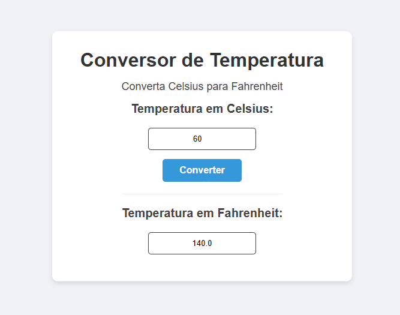

# 🌡️ Temperature Converter

Simple web application that converts temperature from Celsius to Fahrenheit using JavaScript.

## 📸 Project Preview

## 🛠️ Technologies

- HTML
- CSS
- JavaScript

## ⚙️ Features

- Convert temperature from Celsius to Fahrenheit  
- Instant calculation using JavaScript  
- Simple and clean user interface  

## 🎯 Project Goal

Practice basic JavaScript logic and DOM manipulation by building a simple and functional temperature converter.

## 👨‍💻 Author

Luis Francisco